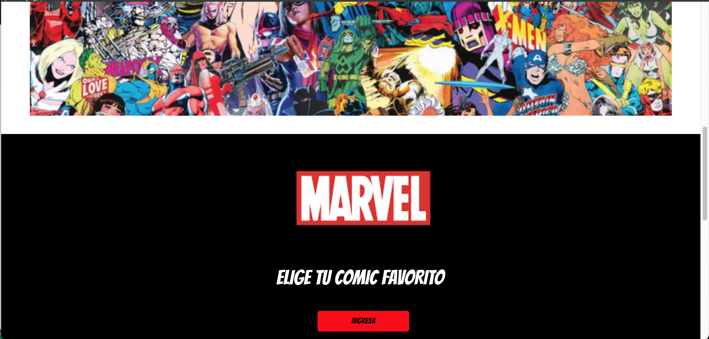
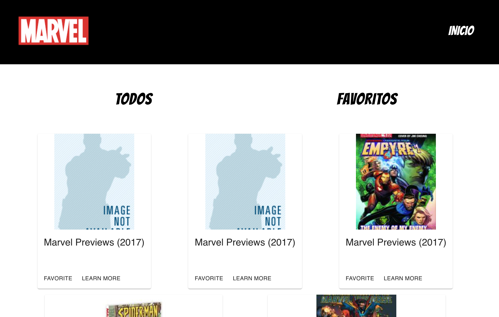
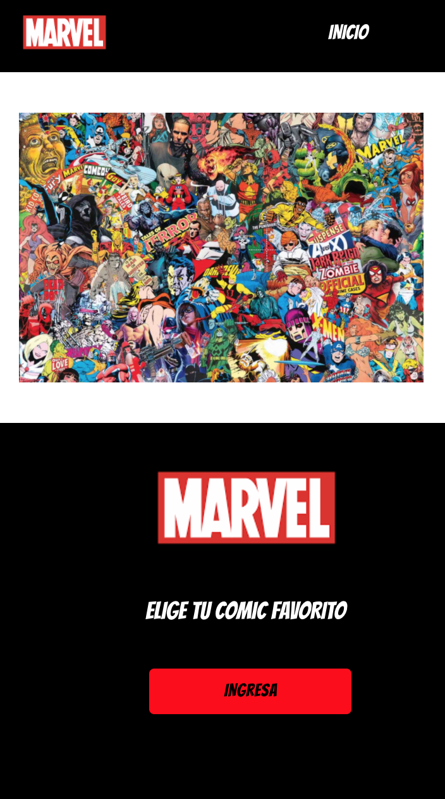
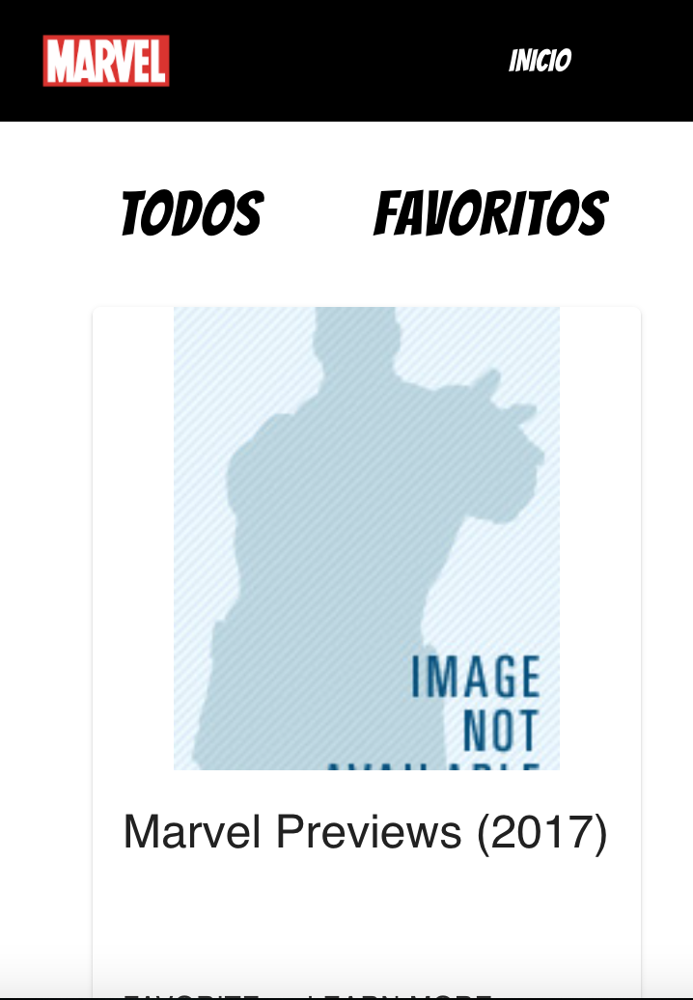
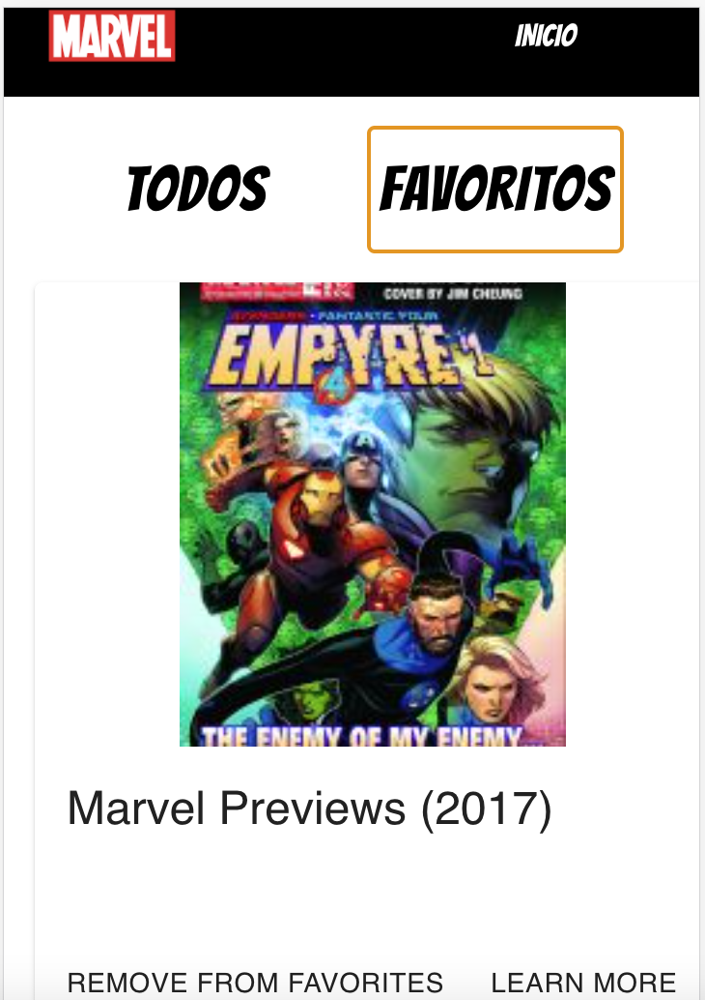

# Marvel API

​

## Índice

​

- [Marvel API](#marvel-api)
  - [Instalación](#instalacion)
  - [Índice](#índice)
  - [1. Preámbulo](#1-preámbulo)
  - [2. Resumen del desarrollo del proyecto](#2-resumen-del-desarrollo-del-proyecto)
  - [3. Carpetas que encontrarás en el repositorio](#3-carpetas-que-encontrarás-en-el-repositorio)
  - [SRC](#src)
    - [Components](#components)
    - [Pages](#Pages)
    - [README](#readme)
  - [4. Look final del proyecto vista de ordenador](#4-look-final-del-proyecto-vista-de-ordenador)
  - [5. Look final del proyecto vista de móvil](#5-look-final-del-proyecto-vista-de-móvil)

​

# Instalación

## Instalar dependencias

```bash
yarn install
```

## 1. Preámbulo

​
Este proyecto se realizo para una prueba técnica, propusimos una pagina donde mostrara la informacion acerca de los comics Marvel, el objetivo principal de este proyecto fue visualizar la data, que el usuario pudiera ingresar, cuando ingresar pudiera elegir los favoritos.
​
​

## 3. Carpetas que encontrarás en el repositorio

## SRC

### Components

| Archivo       | Descripción                    |
| :------------ | :----------------------------- |
| body,js       | Cuerpo de la página            |
| footer.js     | footer de la página            |
| bodyComics.js | body con la data de los comics |
| index. scss   | Estlos del proyecto global     |


### Pages

| Archivo   | Descripción                   |
| :-------- | :---------------------------- |
| inicio.js | Página principal del proyecto |

​

​

### README

​
| Archivo | Descripción |
| :-------- | :---------------------------- |
| readme.md | Información general del proyecto y objetivos de aprendizaje |
​
​

## 4. Look final del proyecto vista de ordenador

​

​


​

## 5. Look final del proyecto vista de móvil






